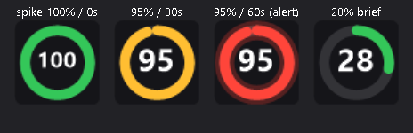
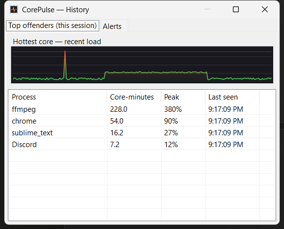

<div align="center">


# CorePulse

### Find the process that's quietly cooking your CPU. CorePulse watches per-core load over time and names the app behind the sustained usage that heats your machine and spins up your fans.

[](https://www.microsoft.com/windows)
[](https://dotnet.microsoft.com/)
[](LICENSE)
[](https://github.com/presetslrdev/CorePulse/releases/latest)
[](#-languages)

</div>

---

## Download

**[⬇ Download the latest release](https://github.com/presetslrdev/CorePulse/releases/latest)** — no installer, no setup. Unzip nothing; just run it.

| File | Pick this if | Size |
|---|---|---|
| **`CorePulse.exe`** | You just want it to run. Nothing else needed. | ~58 MB |
| `CorePulse-net10.exe` | You already have the [.NET 10 Desktop Runtime](https://dotnet.microsoft.com/download/dotnet/10.0). | ~24 MB |

CorePulse keeps itself up to date: it checks GitHub for a new release once a day and offers to update
with one click. You can turn that off in Settings.

### "Windows protected your PC"

CorePulse isn't code-signed yet — a certificate costs a few hundred dollars a year — so SmartScreen
shows a warning the first time you run it. Click **More info → Run anyway**.

If you'd rather verify the download first, every release ships a `SHA256SUMS.txt`:

```powershell
Get-FileHash .\CorePulse.exe -Algorithm SHA256
```

Compare the result with the line for `CorePulse.exe` in `SHA256SUMS.txt`. Note what this does and
doesn't prove: it confirms your download isn't corrupted or truncated, but since the checksums are
published alongside the binary, it isn't protection against a compromised GitHub account. The real
trust anchor is HTTPS and the security of the publishing account.

## Why CorePulse?

Every CPU monitor shows you the **overall** load. But overall load hides the problem that actually
heats your machine: **a single process quietly holding a core busy for a long time.**

Here's the real story that inspired CorePulse: an open editor was using just **20–30% of one core** —
nothing alarming on any usual monitor — yet it kept the CPU warm enough that the liquid-cooling fans
spun up and stayed loud. The overall load looked fine. Task Manager, sorted by momentary CPU, never
pointed at it. The culprit was hiding in plain sight because it was *steady*, not *spiky*.

**CorePulse looks at load over time, per core, and attributes it to a process.** It surfaces the
quiet, sustained CPU consumers — the ones that don't spike but never let go — and names them. So when
your fans won't calm down, you open CorePulse and immediately see *what* is keeping your cores warm.

And it doesn't wait for you to look: CorePulse **notifies you when a single process keeps holding a
core** (by default ≥25% of a core for 10 minutes) — the exact pattern of the quiet cooker — as well as
when any core stays under heavy load for too long. Every alert names the responsible process.

## Tray icon styles

The tray icon is **live** (redrawn ~8×/second) and always leads with the load of your **hottest core**
as a large number. Pick the look you like:

<div align="center">

</div>

### The color means *duration*, not just level

The number is the current load, but the **color reflects how long a core has stayed hot** — so a brief
spike doesn't cry wolf. A momentary jump to 100% stays green; a core that *keeps* holding warms from
green → yellow → red and finally pulses when it crosses your alert duration. That's the whole point:
CorePulse reacts to *sustained* load, not noise.

<div align="center">

</div>

| Style | What it shows |
|-------|---------------|
| **Ring + %** | Ring gauge of the hottest core + big number. Most legible at tiny tray sizes. |
| **Segmented ring** | One segment per core (see them all at a glance), hottest highlighted, its % in the center. |
| **Speedometer** | 270° gauge — the familiar dashboard metaphor. |
| **Liquid + %** | A container that fills to the load level with an animated wave. *(default)* |
| **Dots grid** | A dot per core; each dot fills and colors by its load. |

## Features

- 🎯 **Per-core monitoring** — tracks every logical core, not just the overall average.
- 📜 **Usage history** — a **Top offenders (this session)** ranking by accumulated *core-time* surfaces
  the quiet, steady consumers (the editor at 25% that never lets go), plus a saved log of past alerts.
- 🔔 **Sustained-load alerts, two ways** — a **per-process** alert when one app keeps holding a core
  (e.g. ≥25% for 10 min — the quiet cooker), and a **per-core** alert when any core stays hot too long.
  Both use hysteresis and a cooldown to avoid spam; the core threshold goes as low as 10%.
- 🙈 **Exclusions** — add known-good apps (your IDE, browser, encoder) to an exclusion list so they
  never raise a process alert.
- 🕵️ **Culprit detection** — every alert names the top processes likely responsible, with their CPU share.
- 📊 **Informative live tray icon** — five modern styles, hottest-core load front and center, with
  **color driven by duration** so brief spikes stay calm and only sustained load warms to red.
- 🌍 **8 languages** — auto-detected from your system, switchable in settings.
- 🌗 **Light / dark themes** — follows your Windows theme by default, or pin it to Light or Dark.
- ⬆️ **Updates itself** — checks GitHub once a day, updates with one click, and restarts. Optional.
- 🚀 **Lightweight & no admin rights** — a single tray app, no drivers, no elevation. The only network
  request it ever makes is the update check (one `GET` to `api.github.com`); there is no telemetry of
  any kind, and you can turn the check off in Settings.
- ⚙️ **Configurable** — threshold, duration, cooldown, poll interval, notifications on/off, autostart.
- 🖱️ **One-click Task Manager** — jump straight to the culprit from the notification.

## Usage history — find the quiet offender

Right-click the tray icon → **History**. The **Top offenders** tab ranks every process by the CPU
**core-time** it has accumulated this session — so a process steadily using a fraction of a core
climbs the list over time and gives itself away, even though it never spikes. Above it, a **timeline
of the hottest core** makes the difference obvious: a sustained offender shows a flat *shelf*, a real
spike is just a thin blip. The **Alerts** tab keeps a saved log of past sustained-load events and
their culprits.

<div align="center">

</div>

## Installation

**Requirements:** Windows 10 or 11. The self-contained `CorePulse.exe` needs nothing else;
`CorePulse-net10.exe` needs the [.NET 10 Desktop Runtime](https://dotnet.microsoft.com/download/dotnet/10.0).

Most people should just [download a release](#download). To build it yourself:

### Build from source

```powershell
git clone https://github.com/presetslrdev/CorePulse.git
cd CorePulse
dotnet run --project src/CpuMonitorNotifier
```

Builds from source are stamped as such and never self-update.

### Run the tests

```powershell
dotnet test tests/CorePulse.Tests
```

### Publish it the way CI does

```powershell
dotnet publish src/CpuMonitorNotifier -c Release -r win-x64 --self-contained true `
  -p:PublishSingleFile=true -p:IncludeNativeLibrariesForSelfExtract=true `
  -p:EnableCompressionInSingleFile=true -p:DistributionKind=self-contained
```

## Usage

- Look at the tray icon: the number is your hottest core's load; the color tells you how hot.
- Hover for a tooltip: hottest core, overall CPU, and the greediest process.
- **Right-click** the icon (or double-click) for **Settings** — choose the icon style, language, theme,
  alert threshold/duration/cooldown, poll interval, notifications, exclusions, update checks, and autostart.
- **History** in the menu opens the offenders ranking and alert log (see above).
- **Test notification** in the menu fires a sample toast right away — handy to confirm notifications
  aren't being swallowed by Windows **Focus Assist / Do Not Disturb**.

## How culprit detection works

Windows doesn't expose per-process, per-core CPU statistics without ETW (which needs administrator
rights). CorePulse uses a heuristic that's accurate for the case that matters most:

1. Every second it samples each process's total CPU time and computes the delta — each process's load
   expressed in **cores** (1.0 = one fully-busy core).
2. When a core alerts, it surfaces the processes whose consumption matches the number of saturated cores.
3. For the classic scenario — a hung single-threaded process holding one core at 100% — the guess is
   effectively exact.

See [docs/ARCHITECTURE.md](docs/ARCHITECTURE.md) for the full design, and
[docs/ANALOGS.md](docs/ANALOGS.md) for how CorePulse compares to existing tools.

## Languages

Auto-detected from your system locale, or pick one explicitly in Settings:

🇬🇧 English · 🇷🇺 Русский · 🇩🇪 Deutsch · 🇪🇸 Español · 🇫🇷 Français · 🇧🇷 Português · 🇨🇳 中文 · 🇯🇵 日本語

Adding a language is a single dictionary in [Localization.cs](src/CpuMonitorNotifier/Localization/Localization.cs) —
pull requests welcome.

## How it compares

No existing tool combines all three of per-core visualization, sustained-load alerting, and culprit
naming in one lightweight app:

| | Per-core | Live tray icon | Sustained-load alerts | Names the culprit |
|---|:---:|:---:|:---:|:---:|
| Task Manager tray icon | ✗ | minimal | ✗ | ✗ |
| XMeters | ✓ | ✓ | ✗ | ✗ |
| Process Lasso | ✗ | ✓ | ✓ (by process) | ✓ |
| HWiNFO | ✓ | ✓ | ✓ (sensor thresholds) | ✗ |
| **CorePulse** | **✓** | **✓** | **✓ (per core)** | **✓** |

Full breakdown in [docs/ANALOGS.md](docs/ANALOGS.md).

## Roadmap

- Precise per-core → per-process attribution via ETW CPU sampling (opt-in, requires elevation).
- Optional history graph / mini-sparkline in the tooltip.
- Code signing, to get rid of the SmartScreen warning.
- winget package (`winget install CorePulse`).

## Tech stack

C# · .NET 10 · WinForms tray host · GDI+ rendering · Windows Toast notifications
(`Microsoft.Toolkit.Uwp.Notifications`) · PDH performance counters (`Processor Information`).

## License

[MIT](LICENSE) © 2026 Denis Esis
