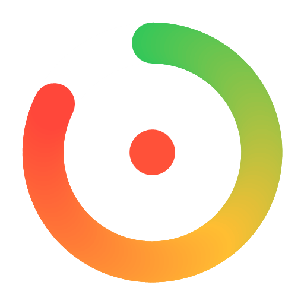
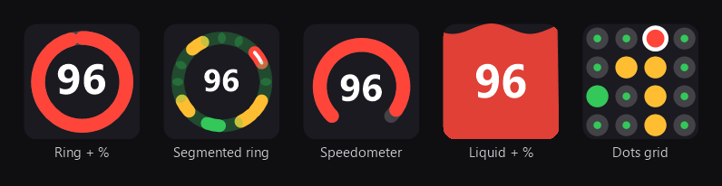

<div align="center">



# CorePulse

### Live per-core CPU monitor for Windows that catches the one core stuck at 100% — and names the process behind it.

[](https://www.microsoft.com/windows)
[](https://dotnet.microsoft.com/)
[](LICENSE)
[](#)
[](#-languages)

</div>

---

## Why CorePulse?

Every CPU monitor shows you the **overall** load. But overall load hides the problem that actually
slows your machine down: **a single core pinned at 100%.**

A hung single-threaded process, a runaway background service, or a stray busy-loop will saturate one
core and stutter your system — yet on a 16-core CPU that's only ~6% overall load. Task Manager stays
calm. Nothing alerts you. You only notice when your fans spin up an hour later.

**CorePulse watches every core individually.** When any core stays under heavy load for too long, it
raises a notification and **tells you which process is responsible** — so you can act in seconds, not
after digging through Resource Monitor.

## Tray icon styles

The tray icon is **live** (redrawn ~8×/second) and always leads with the load of your **hottest core** —
as a large number and a color that shifts green → yellow → red. Pick the look you like:

<div align="center">

</div>

| Style | What it shows |
|-------|---------------|
| **Ring + %** | Ring gauge of the hottest core + big number. Most legible at tiny tray sizes. *(default)* |
| **Segmented ring** | One segment per core (see them all at a glance), hottest highlighted, its % in the center. |
| **Speedometer** | 270° gauge — the familiar dashboard metaphor. |
| **Liquid + %** | A container that fills to the load level with an animated wave. |
| **Dots grid** | A dot per core; each dot fills and colors by its load. |

## Features

- 🎯 **Per-core monitoring** — tracks every logical core, not just the overall average.
- 🔔 **Smart, sustained-load alerts** — fires only when a core stays above your threshold for a set
  duration (default 90% for 60s), with hysteresis and a per-core cooldown to avoid spam.
- 🕵️ **Culprit detection** — every alert names the top processes likely responsible, with their CPU share.
- 📊 **Informative live tray icon** — five modern styles, hottest-core load front and center.
- 🌍 **8 languages** — auto-detected from your system, switchable in settings.
- 🚀 **Lightweight & no admin rights** — a single tray app, no drivers, no elevation.
- ⚙️ **Configurable** — threshold, duration, cooldown, poll interval, notifications on/off, autostart.
- 🖱️ **One-click Task Manager** — jump straight to the culprit from the notification.

## Installation

**Requirements:** Windows 10 or 11, [.NET 10 Runtime](https://dotnet.microsoft.com/download/dotnet/10.0)
(the Desktop Runtime).

### Build from source

```powershell
git clone <your-fork-url> CorePulse
cd CorePulse
dotnet run --project src/CpuMonitorNotifier
```

### Publish a single executable

```powershell
dotnet publish src/CpuMonitorNotifier -c Release -r win-x64 --self-contained false
```

## Usage

- Look at the tray icon: the number is your hottest core's load; the color tells you how hot.
- Hover for a tooltip: hottest core, overall CPU, and the greediest process.
- **Right-click** the icon (or double-click) for **Settings** — choose the icon style, language,
  alert threshold/duration/cooldown, poll interval, notifications, and autostart.
- **Test notification** in the menu fires a sample toast right away — handy to confirm notifications
  aren't being swallowed by Windows **Focus Assist / Do Not Disturb**.

## How culprit detection works

Windows doesn't expose per-process, per-core CPU statistics without ETW (which needs administrator
rights). CorePulse uses a heuristic that's accurate for the case that matters most:

1. Every second it samples each process's total CPU time and computes the delta — each process's load
   expressed in **cores** (1.0 = one fully-busy core).
2. When a core alerts, it surfaces the processes whose consumption matches the number of saturated cores.
3. For the classic scenario — a hung single-threaded process holding one core at 100% — the guess is
   effectively exact.

See [docs/ARCHITECTURE.md](docs/ARCHITECTURE.md) for the full design, and
[docs/ANALOGS.md](docs/ANALOGS.md) for how CorePulse compares to existing tools.

## Languages

Auto-detected from your system locale, or pick one explicitly in Settings:

🇬🇧 English · 🇷🇺 Русский · 🇩🇪 Deutsch · 🇪🇸 Español · 🇫🇷 Français · 🇧🇷 Português · 🇨🇳 中文 · 🇯🇵 日本語

Adding a language is a single dictionary in [Localization.cs](src/CpuMonitorNotifier/Localization/Localization.cs) —
pull requests welcome.

## How it compares

No existing tool combines all three of per-core visualization, sustained-load alerting, and culprit
naming in one lightweight app:

| | Per-core | Live tray icon | Sustained-load alerts | Names the culprit |
|---|:---:|:---:|:---:|:---:|
| Task Manager tray icon | ✗ | minimal | ✗ | ✗ |
| XMeters | ✓ | ✓ | ✗ | ✗ |
| Process Lasso | ✗ | ✓ | ✓ (by process) | ✓ |
| HWiNFO | ✓ | ✓ | ✓ (sensor thresholds) | ✗ |
| **CorePulse** | **✓** | **✓** | **✓ (per core)** | **✓** |

Full breakdown in [docs/ANALOGS.md](docs/ANALOGS.md).

## Roadmap

- Precise per-core → per-process attribution via ETW CPU sampling (opt-in, requires elevation).
- Optional history graph / mini-sparkline in the tooltip.
- Portable single-file self-contained build.

## Tech stack

C# · .NET 10 · WinForms tray host · GDI+ rendering · Windows Toast notifications
(`Microsoft.Toolkit.Uwp.Notifications`) · PDH performance counters (`Processor Information`).

## License

[MIT](LICENSE) © 2026 Denis Esis
